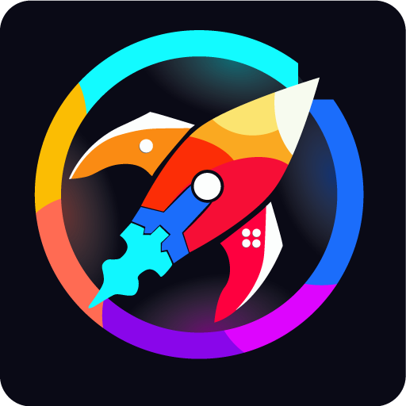

# Photon Game Launcher (big picture mode)

**A beautifull and very user friendly app to launch all your installed games** from any thirdparty launcher (Steam, GOG Galaxy, ...) with your gamepad, keyboard or mouse.

This app aimed to solve 2 mains issues :
- Unified games into one interface instead of multiple launchers
- Launch games without mouse or keyboard for cloud computing (like https://shadow.tech), media server connected to TV or Windows handled gaming console.

Works only on MS Windows (no MAC OS, Linux or Android support). It's a standalone app who run in fullscreen.


# Features
A simple app yes, but with powerfull features :

- Auto scan games in your computer and automatically fetch images
- Add manually any app. Supported extension : .exe, .lnk and .url.
- Change image of any games/app manually
- Add to favourite or hide an app
- Switch windows (Alt+tab) with your gamepad (when you have no keyboard)
- Auto-launch at Windows startup
- English and French language support
- Support any screen ratio and pixel density (from mobile portrait, ultra-wide, 4K TV, ...)


# Auto scan process

For auto scan process, following platforms are currently supported : 
- Amazon Games;
- Battle.net;
- Big Fish Games;
- EA [formerly Origin];
- Epic Games Launcher;
- Game Jolt Client;
- GOG Galaxy;
- Humble App;
- Indiegala Client;
- itch;
- Legacy Games;
- Oculus;
- Paradox Launcher;
- Plarium Play;
- Riot Client;
- Rockstar Games Launcher;
- Steam;
- Ubisoft Connect [formerly Uplay];
- Wargaming.net Game Center.

The scanning process use this library : https://github.com/Solaire/GLC


# Development

Install dependencies with : 
```
yarn
```

Start dev app with : 
```
yarn start
```

Build installer & executable :
```
yarn make
```

Some doc can be found in the `/docs` folder

# Credits
Some credits can be found within the app but, particular thanks to :
- GLC (GPL 3.0): https://github.com/Solaire/GLC
- Electron (MIT): https://github.com/electron/electron
- NoriginSpacialNavigation (MIT): https://github.com/NoriginMedia/Norigin-Spatial-Navigation
